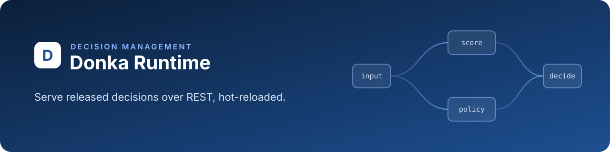

<h1 align="center">Donka Runtime</h1>

<p align="center">
    Serve released credit decisions over REST, hot-reloaded from object storage
</p>

<p align="center">
    <a href="https://github.com/youmssi/donka-runtime/actions/workflows/ci.yml"></a>
    <a href="LICENSE"></a>
    
    
    <a href="Dockerfile"></a>
    <a href="https://github.com/youmssi/donka"></a>
</p>

<p align="center">
    <a href="docs/configuration.md">Configuration</a> ·
    <a href="docs/connectors.md">Connectors</a> ·
    <a href="docs/decision-log.md">Decision log</a> ·
    <a href="docs/contracts.md">Input contracts</a> ·
    <a href="docs/rules-openapi.md">Rules OpenAPI</a> ·
    <a href="CONTRIBUTING.md">Contributing</a>
</p>

## Introduction

[Donka](https://github.com/youmssi/donka) is a decision management platform for credit and risk
teams. Analysts build, test and approve scoring rules in Donka Studio, which publishes each
release to object storage.

Donka Runtime is the standalone service your systems call for a decision. It loads the releases
Studio published, reloads them the moment they change, and evaluates them with the
[ZEN engine](https://github.com/gorules/zen), with no UI and no database to run.

## Features

- **Hot reload**: picks up a new release (or a rollback) from S3, MinIO, Azure Blob, GCS or local
  files without a restart
- **Per-environment tokens**: callers send `X-Access-Token`; only hashes are in the release, and a
  staging token is refused by production
- **Connectors**: decisions call credit bureaus, KYC or AML providers, with timeouts, retries, a
  circuit breaker and secrets kept in the environment
- **Decision log**: every evaluation goes to Studio in the background, for search, explanation
  and replay, without slowing the answer
- **Rate limits**: a per-token request limit, answered with `429` and `Retry-After`; health is
  never limited
- **Traces on demand**: `trace: true` shows how each node reached its result
- **Rules OpenAPI**: one OpenAPI document per project, with schemas derived from the rules
- **Production-ready**: graceful shutdown, health and version endpoints, one small container

## Quick start

Run it against a MinIO bucket that Studio publishes the `staging` environment to:

```bash
docker build -t donka-runtime .
docker run --rm -p 8080:8080 \
  -e PROVIDER__TYPE=S3 -e PROVIDER__BUCKET=donka-releases -e PROVIDER__REGION=us-east-1 \
  -e PROVIDER__ENDPOINT=http://minio:9000 -e PROVIDER__FORCE_PATH_STYLE=true \
  -e PROVIDER__PREFIX=staging/ \
  -e AWS_ACCESS_KEY_ID=... -e AWS_SECRET_ACCESS_KEY=... \
  donka-runtime
```

Then ask for a decision with a token issued in Studio (**Environments → Runtime tokens**):

```bash
curl -s -X POST localhost:8080/api/projects/credit-pme/evaluate/eligibility \
  -H "X-Access-Token: $DONKA_RUNTIME_TOKEN" -H 'content-type: application/json' \
  -H 'X-Donka-Reference: APP-2026-0042' \
  -d '{ "context": { "applicant": { "monthlyIncome": 450000 } } }'
```

| Endpoint                                     | What it does                                   |
| -------------------------------------------- | ---------------------------------------------- |
| `POST /api/projects/{project}/evaluate/{key}` | Evaluate a decision (`context`, `trace`)      |
| `POST /api/rules/{project}/evaluate/{path}`   | Evaluate a rule by path                       |
| `GET /api/rules/{project}`                    | OpenAPI document of the project's rules       |
| `GET /api/projects/{project}/entrypoints`     | The decisions a project exposes               |
| `GET /api/health`, `GET /api/version`         | Health and version                            |
| `GET /api/docs`                               | Interactive API documentation                 |

Every storage provider, token rule and setting is in [docs/configuration.md](docs/configuration.md).

## Documentation

| Page                                           | What it covers                                                  |
| ---------------------------------------------- | --------------------------------------------------------------- |
| [docs/configuration.md](docs/configuration.md) | Release storage, listening address, access tokens, rate limits  |
| [docs/connectors.md](docs/connectors.md)       | Connector nodes, secrets, timeouts, retries, circuit breaker    |
| [docs/decision-log.md](docs/decision-log.md)   | The feed to Studio, references, batching, retries, shutdown     |
| [docs/contracts.md](docs/contracts.md)         | Input contracts: the `400` naming the field a request gets wrong |
| [docs/rules-openapi.md](docs/rules-openapi.md) | Rules OpenAPI, TypeScript type resolution, build caching        |
| [Artifact format](https://github.com/youmssi/donka/blob/develop/docs/artifact-format.md) | What Studio publishes (`.config/project.json`) |
| [DONKA.md](DONKA.md)                           | What this fork changes from upstream                            |

## Contributing

Read [AGENTS.md](AGENTS.md) and [CONTRIBUTING.md](CONTRIBUTING.md) first. Stories live in the
[Studio backlog](https://github.com/youmssi/donka/tree/develop/docs/backlog); each one gets a
`dnk-<n>-<slug>` branch, squash-merged into `develop`.

```bash
cargo fmt --all --check
cargo clippy --all-targets
cargo test                    # tests/it needs Docker (MinIO, Azurite)
cargo test -p donka-connectors
```

## License

MIT, see [LICENSE](LICENSE). Donka Runtime is a fork of
[gorules/agent-public](https://github.com/gorules/agent-public); the original copyright notice
is kept.
